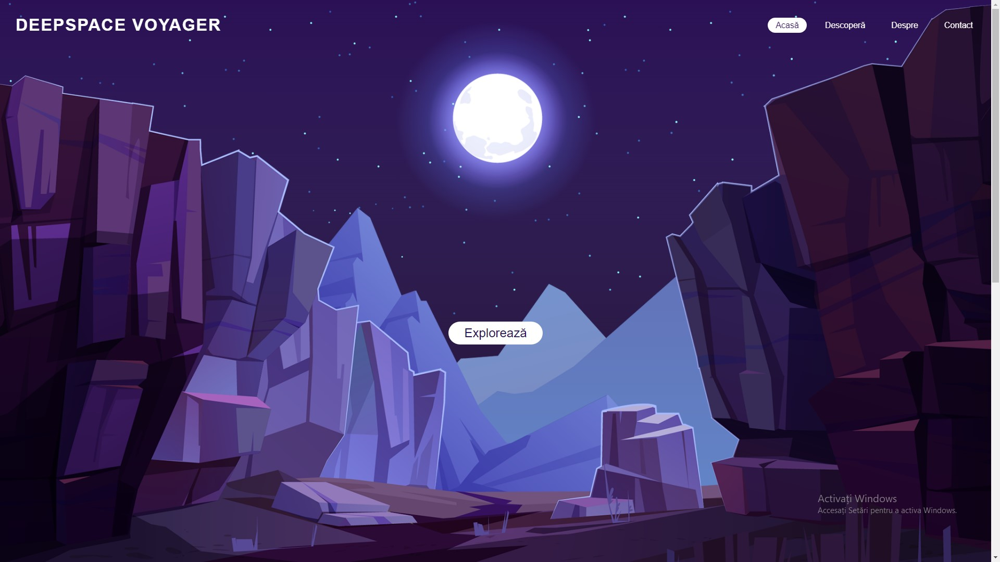

# Proiect Prosoft: *DeepSpace Voyager*

# Capitole:

## I. Descriere
DeepSpace Voyager este o platformă web care urmărește să ofere un alt tip de experiențe oricărui pasionat de călătorii.
Pornind de la tema „*Orizonturi noi*”, site-ul dorește să planifice călătorii spațiale, în funcție de preferințele utilizatorului.

Site-ul prelucrează astfel datele introduse de client, iar un algoritm alege dintr-o gamă largă de destinații pe cea mai apropiată pentru acesta.
Totodată, oferă o scurtă descriere a destinației/ călătoriei alese și o serie de imagini sugestive.

## II. Particularități de construcție ale site-ului
- Design modern al secțiunilor de pe pagini, folosind cod CSS;
- Cromatică constantă și plăcută ochiului;
- Elemente animate pentru o experiență fluidă, folosind elemente și funcții de tip „*Parallax*”; 
- Implementarea tuturor paginilor într-o singură fereastră;
- Efecte vizuale asupra textului;
- Mișcări line între diferitele secțiuni;
- Galerie dinamică de imagini; 
- Text interactiv;
- Accesibilitatea site-ului în mediul online;
- Publicarea site-ului pe o platformă de versionare a codului sursă (github.com);
- Portabilitate pe o gamă multiplă de dispozitive.

## III. Implementare
### 1. Pagina acasă (index.html)

### 2. Pagina de generare a călătoriei (Descopera.html)

### 3. Pagina de descriere și contact (Despre.html, Contact.html)

### 4. Aducerea site-ului online
