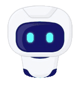

# Documentație Proiect Prosoft: *DeepSpace Voyager*

Propunător și dezvoltator proiect: Secure George-Sebastian

Unitatea de învățământ: Colegiul Național de Informatică, Piatra-Neamț


# Capitole:

## I. Descriere

DeepSpace Voyager este o platformă web care urmărește să ofere un alt tip de experiențe oricărui pasionat de călătorii și se adresează unui număr cât mai mare de pasionați de domeniu.
Pornind de la tema „*Orizonturi noi*”, site-ul dorește să planifice călătorii spațiale, în funcție de preferințele utilizatorului.

Site-ul prelucrează astfel datele introduse de client, iar un algoritm alege dintr-o gamă largă de destinații pe cea mai apropiată pentru acesta.
Totodată, oferă o scurtă descriere a destinației/ călătoriei alese și o serie de imagini sugestive.

## II. Particularități de construcție ale site-ului

- Design modern al secțiunilor de pe pagini, folosind cod CSS;
- Cromatică constantă și plăcută ochiului;
- Elemente animate pentru o experiență fluidă, folosind elemente și funcții de tip „*Parallax*”; 
- Implementarea tuturor paginilor într-o singură fereastră;
- Efecte vizuale asupra textului;
- Mișcări line între diferitele secțiuni;
- Galerie dinamică de imagini; 
- Text interactiv;
- Accesibilitatea site-ului în mediul online;
- Publicarea site-ului pe o platformă de versionare a codului sursă (github.com);
- Portabilitate pe o gamă multiplă de dispozitive.

## III. Implementare

### 1. Pagina acasă (index.html)


#### Design folosind cod în CSS:

https://github.com/ApyrGeo/DeepSpace-Voyager/blob/92e7b3c52241cf1a1de6783ad5380da6ea69d412/index.html#L9-L163

#### Elementele de pe pagină:
```html
	<body>
		<header>
			<a href="#" class="logo" onclick="window.location.replace('index.html')">DeepSpace Voyager</a>
			<ul>
				<li><a href="#" class="active">Acasă</a></li>
				<li><a href="#" onclick="window.location.replace('Descopera.html')";>Descoperă</a></li>
				<li><a href="#" onclick="window.location.replace('Despre.html')">Despre</a></li>
				<li><a href="#" onclick="window.location.replace('Contact.html')">Contact</a></li>
			</ul>
		</header>
		<section>
			
			
			
			<h2 id="text">Un nou tip de călătorii</h2>
			<a href="#sec" id="btn">Explorează</a>
			
		</section>
		<div class="sec" id="sec">
			<h2>Despre ce este vorba?</h2>
			<br><br>
			<br><br>
			<p>Bine ați venit pe site-ul nostru de expediție spațială personalizată! Aici vă oferim o experiență unică în care puteți să vă proiectați propria expediție spațială bazată pe preferințele și dorințele personale.
			<br><br>
			La începutul călătoriei, veți fi întâmpinat de un asistent virtual inteligent, care va lucra cu dumneavoastră pentru a determina destinațiile și activitățile preferate.
			<br><br>
			Site-ul nostru utilizează cele mai recente tehnologii în domeniul inteligenței artificiale și machine learning pentru a vă oferi sugestii personalizate de destinații și activități.
			<br><br>
			În plus, oferim și o varietate de opțiuni de transport spațial, inclusiv nave spațiale de lux și vehicule personale, astfel încât să puteți alege o experiență care să se potrivească bugetului și preferințelor dumneavoastră. Vă vom ajuta să alegeți cele mai bune obiective spațiale și să planificați itinerariul dumneavoastră astfel încât să vă puteți concentra asupra aventurii dumneavoastră spațiale.
			<br><br>
			La sfârșitul călătoriei, veți primi o amintire personalizată, cum ar fi o hartă a sistemului solar cu marcajele dumneavoastră, sau o fotografie personalizată de pe o planetă îndepărtată, pentru a vă aminti întotdeauna de această experiență unică.
			<br><br>
			Vă invităm să începeți călătoria acum și să experimentați frumusețea și misterul spațiului cosmic!
			</p>
		
			<a href="#" id="btn1" onclick="window.location.replace('Descopera.html')">Începe</a>
		</div>
```

#### Funcții:

- Mișcarea obiectelor pe fundal:

```js
			let stars = document.getElementById('stars');
			let moon = document.getElementById('moon');
			let munti = document.getElementById('munti');
			let front = document.getElementById('front');
			let btn = document.getElementById('btn');
			let text = document.getElementById('text');
			let header= document.querySelector('header');
			
			window.addEventListener('scroll',function(){
				let value=window.scrollY;
				stars.style.left = value * 0.25 + 'px';
				moon.style.top = value * 1 + 'px';
				munti.style.top = value * 0.5 + 'px';
				front.style.top = value * 0 + 'px';
				text.style.marginRight =  value * 4 + 'px';
				text.style.marginTop =  value * 1.5 + 'px';
				btn.style.marginTop =  value * 1.5 + 'px';
				header.style.top= value * 0.5 + 'px';
			})
```

- Formatare aspect pentru telefoane:

```js
  			function detectMob() {
				const toMatch = [
				/Android/i,
				/webOS/i,
				/iPhone/i,
				/iPad/i,
				/iPod/i,
				/BlackBerry/i,
				/Windows Phone/i
			];
    
				return toMatch.some((toMatchItem) => {
				return navigator.userAgent.match(toMatchItem);
				});
			
			}
			if(detectMob())
			{
				document.body.style.width="110vw";
			}
```

### 2. Pagina de generare a călătoriei (Descopera.html)


#### Elemente noi de CSS:

https://github.com/ApyrGeo/DeepSpace-Voyager/blob/912015b44e17849f2119ea514f75adf3c0881995/Descopera.html#L87-L192

#### Elemente ale paginii:

```html
  		<header>
			<a href="#" class="logo" onclick="window.location.replace('index.html')">DeepSpace Voyager</a>
			<ul>
				<li><a href="#" onclick="window.location.replace('index.html')">Acasă</a></li>
				<li><a href="#" onclick="window.location.replace('Descopera.html')" class="active">Descoperă</a></li>
				<li><a href="#" onclick="window.location.replace('Despre.html')">Despre</a></li>
				<li><a href="#" onclick="window.location.replace('Contact.html')">Contact</a></li>
			</ul>
		</header>
		<section>
			
			<h2 id="intrebare" class="intrebari">Mai întâi, vrem să știm mai multe despre tine...</h2>
			
			
			<div class="select">
				<select style="display:none" id="buget" onchange="hideAndShowSelectBox()" class="buget" >
					<option value="">--Alege--</option>
					<option value="Mare" id="mare">Peste 1.500 M$</option>
					<option value="Mic" id="mic">Sub 1.500 M$</option>
					<option value="Variabil">Variabil</option>
				</select>
			
				<select style="display:none" id="interes" onchange="hideAndShowSelectBox()" class="interes" >
					<option value="">--Alege--</option>
					<option value="Sejur">Sejur la un Hotel Spațial</option>
					<option value="Business">Business</option>
					<option value="Tur">Tur în jurul unor obiective spațiale</option>
					<option value="Cercetare">Cercetare</option>
					<option value="Interrelationare">Interrelaționare cu alte entități</option>
					
				</select>
			
				<select style="display:none" id="tip" onchange="hideAndShowSelectBox()" class="tip">
					<option value="">--Alege--</option>
					<option value="Turism pe alte planete">Turism în Sistemul nostru Solar</option>
					<option value="Calatorii intergalactice">Călătorii Intergalactice</option>
				</select>
			</div>
			<div class="rezultat" id="rezultat">
				
			</div>
			
		</section>
```

#### Funcții:

- Generarea rezultatului:

Funcția ia valorile din cele 3 căsuțe cu opțiuni și găsește rezultatul potrivit:

```js
			if(buget==="Mare")
			{
				if(tip==="Turism pe alte planete")
				{
					if(interes==="Sejur")
					{...}
					if(interes==="Business")
					{...}
					if(interes==="Tur")
					{...}
					if(interes==="Cercetare")
					{...}
					if(interes==="Interrelationare")
					{...}
				}
				if(tip==="Calatorii intergalactice")
				{
					if(interes==="Sejur")
					{...}
					if(interes==="Business")
					{...}
					if(interes==="Tur")
					{...}
					if(interes==="Cercetare")
					{...}
					if(interes==="Interrelationare")
					{...}
				}
			}
			if(buget==="Mare")
			{
				if(tip==="Turism pe alte planete")
				{
					if(interes==="Sejur")
					{...}
					if(interes==="Business")
					{...}
					if(interes==="Tur")
					{...}
					if(interes==="Cercetare")
					{...}
					if(interes==="Interrelationare")
					{...}
				}
				if(tip==="Calatorii intergalactice")
				{
					if(interes==="Sejur")
					{...}
					if(interes==="Business")
					{...}
					if(interes==="Tur")
					{...}
					if(interes==="Cercetare")
					{...}
					if(interes==="Interrelationare")
					{...}
				}
			}
```

Se salvează astfel un titlu, o descriere și 6 imagini în vectorul sugestii[].

Unde este cazul, poate fi mai mult de o opțiune valabilă.

Exemplu:

```js
						if(x==0)
						{
							sugestii.push
							({
							nume:'Sejur la "Sunwave Space Resort"',
							imagine:"imagini/111_0.jpg",
							descriere:
							"Sunwave Space Resort este un hotel spațial situat în apropierea Soarelui, la o distanță sigură și controlată pentru confortul oaspeților săi. Hotelul oferă o gamă largă de facilități și servicii de calitate pentru a se asigura că oaspeții lor au o experiență de neuitat."+
							"<br><br>"+
							"Designul hotelului este futurist, cu o formă circulară care permite oaspeților să se bucure de priveliștea spectaculoasă a Soarelui și a spațiului cosmic din fiecare cameră. Fiecare cameră este echipată cu ferestre panoramice și ecran plat pentru a oferi o experiență de vizionare cât mai realistă și autentică."+
							"<br><br>"+
							"Preț: 2750 M$"
							
							});
							sugestii.push
							({
							imagine:"imagini/111_1.jpg"
							});
							sugestii.push
							({
							imagine:"imagini/111_2.jpg"
							});
							sugestii.push
							({
							imagine:"imagini/111_3.jpg"
							});
							sugestii.push
							({
							imagine:"imagini/111_4.jpg"
							});
							sugestii.push
							({
							imagine:"imagini/111_5.jpg"
							});
						}
						if(x==1)
						{
							sugestii.push({
							nume:'Sejur la "Cosmic Oasis Spa Resort"',
							imagine:"imagini/111s_0.jpg",
							descriere:
							"Cosmic Oasis Spa Resort este un centru de spa aflat în spațiul cosmic, care dispune de o gamă largă de facilități, incluzând o piscină cu apă sărată, o saună, o sală de fitness și o sală de masaj, toate fiind proiectate pentru a oferi o experiență de relaxare maximă."+
							"<br><br>"+
							"În plus, resortul oferă și programe de wellness personalizate, precum yoga spațială, meditație și terapie cu lumină și sunet."+
							"<br><br>"+
							"Preț: 3525 M$"
							});
							sugestii.push
							({
							imagine:"imagini/111s_1.jpg"
							});
							sugestii.push
							({
							imagine:"imagini/111s_2.jpg"
							});
							sugestii.push
							({
							imagine:"imagini/111s_3.jpg"
							});
							sugestii.push
							({
							imagine:"imagini/111s_4.jpg"
							});
							sugestii.push
							({
							imagine:"imagini/111s_0.jpg"
							});
						}
					}
```

Se schimbă apoi valorile din ```<div class="rezultat" id="rezultat"></div>``` cu un titlu, o descriere și 6 poze generate, salvate în vectorul sugestii[]:

```js
			if(ok)
				{	
					let rezultat=document.getElementById("rezultat");
	
						rezultat.innerHTML =
							"<h1>" + sugestii[0].nume + "</h1>"+
							
							'<div id="image-track" data-mouse-down-at="0" data-prev-percentage="0">'
								+''
								+''
								+''
								+''
								+''
								+''
							+"</div>"
							+"<h3>"+sugestii[0].descriere+"</h3>";
						
					pozeRezultat();
					rezultat.scrollIntoView(true);
					
				}
```

- Efectul vizual al textului:

Generează litere la întâmplare, iar pe rând fiecare literă adoptă valoarea corectă:

```js
      const letters = "abcdefghijklmnopqrstuvwxyz";
			function effect()
			{
				
				const element= document.querySelector("h2");
				element.dataset.value=element.innerText; 
				{
					let iterations =0;
					const interval= setInterval(()=>{
						element.innerText =element.innerText.split("")
						.map((letter,index)=>{
						
							if(index < iterations)
							{
								return element.dataset.value[index];
							}
							return letters[Math.floor(Math.random()*26)]
						})
						.join("");
					
						if(iterations >= element.dataset.value.length) 
						{
							clearInterval(interval);
						}
						iterations += 1;
						
					},30);
				}
			}
```

- Efectul de dispariție al textului și al căsuței de selecție, după alegerea unei opțiuni:

```js
			effect();
			function urmintrebare1()
			{
				document.getElementById("intrebare").innerHTML = "Ce tip de călătorie ți-ar plăcea cel mai mult?";
				let element=document.getElementById("tip");
				
				element.style.display="";
				
				effect();
			}
			function urmintrebare2()
			{
				
				document.getElementById("intrebare").innerHTML = "Care este scopul călătoriei?";
				let element=document.getElementById("interes");
				element.style.display="";
				
				effect();
			}
			function urmintrebare3()
			{
				document.getElementById("intrebare").innerHTML = "Care este bugetul pe care îl ai planificat?";
				let element=document.getElementById("buget");
				element.style.display="";
				
				effect();
				
			}
			setTimeout(urmintrebare1,5000);
```
```js
			function hideAndShowSelectBox() 
			{
				var selectedValue = document.getElementById("tip").value;
				if(selectedValue != "") 
				{
					document.getElementById("tip").style.display = "none";
					urmintrebare2();	
				}
				if(document.getElementById("interes").value != "") 
				{
					
					document.getElementById("interes").style.display = "none";
					urmintrebare3();
					if(document.getElementById("tip").value==="Calatorii intergalactice")
					{
						document.getElementById("mare").innerText="Peste 10.000 M$";
						document.getElementById("mic").innerText="Sub 10.000 M$";
					}
					
				}
				if(document.getElementById("buget").value != "") 
				{
					document.getElementById("buget").style.display = "none";
					document.getElementById("intrebare").style.display="none";
					AfisareRezultat();
				}
			}
```

- Opțiunea de mișcare al imaginilor generate, alături de efectul "Parallax":

```js
  			function pozeRezultat()
			{
			
				const track= document.getElementById("image-track");
			
				function handleOnUp()
				{
					track.dataset.mouseDownAt = "0";
					track.dataset.prevPercentage = track.dataset.percentage;
				}
			
				function handleOnDown(e)
				{
					track.dataset.mouseDownAt= e.clientX;
				}
			
				function handleOnMove(e)
				{
					if(track.dataset.mouseDownAt === "0") return;
				
					const mouseDelta= parseFloat(track.dataset.mouseDownAt) -e.clientX,
							maxDelta= window.innerWidth /2;
						
					const percentage =(mouseDelta/ maxDelta) * -100,
						nextPercentageUnconstrained =parseFloat(track.dataset.prevPercentage)+ percentage;
						nextPercentage= Math.max(Math.min(nextPercentageUnconstrained, 0),-100);
				
					for(const image of track.getElementsByClassName("image"))
					{
						image.animate(
							{objectPosition: `${100 + nextPercentage}% center`},
							{ duration: 1200, fill: "forwards" }
						);
					}
				
					track.dataset.percentage = nextPercentage;
				
					track.animate
					(
						{transform: `translate(${nextPercentage}%, -50%)`},
						{ duration: 1200, fill: "forwards" }
					);
	
			}
			
				window.onmousedown = e => handleOnDown(e);


				window.ontouchstart = e => handleOnDown(e.touches[0]);


				window.onmouseup = e => handleOnUp(e);


				window.ontouchend = e => handleOnUp(e.touches[0]);


				window.onmousemove = e => handleOnMove(e);


				window.ontouchmove = e => handleOnMove(e.touches[0]);
			
			}				
```

Se poate observa la final implementarea efectului pe alte dispozitive(cu touchscreen).

- Formatare aspect pentru telefoane:

```js
  			function detectMob() {
				const toMatch = [
				/Android/i,
				/webOS/i,
				/iPhone/i,
				/iPad/i,
				/iPod/i,
				/BlackBerry/i,
				/Windows Phone/i
			];
    
				return toMatch.some((toMatchItem) => {
				return navigator.userAgent.match(toMatchItem);
				});
			
			}
			if(detectMob())
			{
				document.body.style.width="110vw";
			}
```

### 3. Pagina de descriere și contact (Despre.html, Contact.html)


#### Elemente de CSS

https://github.com/ApyrGeo/DeepSpace-Voyager/blob/912015b44e17849f2119ea514f75adf3c0881995/Despre.html#L6-L102

#### Compoziția paginilor

- Despre.html:

```html
		<header>
			<a href="#" class="logo" onclick="window.location.replace('index.html')">DeepSpace Voyager</a>
			<ul>
				<li><a href="#" onclick="window.location.replace('index.html')">Acasă</a></li>
				<li><a href="#" onclick="window.location.replace('Descopera.html')">Descoperă</a></li>
				<li><a href="#" class="active">Despre</a></li>
				<li><a href="#" onclick="window.location.replace('Contact.html')">Contact</a></li>
			</ul>
		</header>
		<section>
			
			
			<div class="sec" id="sec">
				<br><br>
				<br><br>
				<p>
					Misiunea noastră este să inspirăm oamenii să exploreze necunoscutul. Suntem o echipă dedicată care creează experiențe spațiale unice și inovatoare, adaptate preferințelor fiecărui utilizator.
				<br><br>
					Compania noastră a fost fondată din pasiunea pentru explorare și dorința de a face spațiul o destinație accesibilă pentru toți. Am început ca o mică echipă de entuziaști ai spațiului și am evoluat într-o echipă care oferă excursii spațiale personalizate pentru clienții noștri.
				<br><br>
					Am realizat astfel că nu era nevoie să fii un astronaut experimentat pentru a vedea frumusețea și misterul spațiului. Am început astfel să oferim călătorii spațiale pentru amatorii care doresc să trăiască această aventură.
				<br><br>
					Toate călătoriile includ transportul cu naveta spațială, cazare, masă, activități spațiale personalizate și echipament spațial de înaltă performanță.
				<br><br>
					Am avut ocazia de a servi oameni din diferite domenii, inclusiv oameni de afaceri, oameni de știință, sportivi de performanță și celebrități.
				<br><br>
					Valorile noastre sunt centrate pe siguranță, inovație, adaptabilitate și respect pentru mediul spațial. Noi încercăm să oferim clienților noștri cele mai bune experiențe spațiale posibile, într-un mod sigur și sustenabil.
				<br><br>
					În spatele acestui site, există o echipă de experți în tehnologie și călătorii spațiale, care utilizează cele mai recente tehnologii pentru a crea expediții spațiale personalizate, bazate pe preferințele și dorințele dumneavoastră.
				<br><br>
					Am lucrat din greu pentru a dezvolta o platformă ușor de utilizat, care să permită vizitatorilor noștri să-și proiecteze propria expediție spațială. În plus, echipa noastră este mereu pregătită să vă ajute cu orice întrebări sau nelămuriri aveți.
				<br><br>
					Mulțumim pentru interesul dumneavoastră în site-ul nostru și sperăm să vă ajutăm să vă transformați visul de a călători în spațiul cosmic în realitate.
				</p>
		
			</div>
```

- Contact.html:

Numerele de telefon și adresa de e-mail pot fi accesate direct prin apăsare.

```html
		<header>
			<a href="#" class="logo" onclick="window.location.replace('index.html')">DeepSpace Voyager</a>
			<ul>
				<li><a href="#" onclick="window.location.replace('index.html')">Acasă</a></li>
				<li><a href="#" onclick="window.location.replace('Descopera.html')">Descoperă</a></li>
				<li><a href="#" onclick="window.location.replace('Despre.html')">Despre</a></li>
				<li><a href="#" class="active">Contact</a></li>
			</ul>
		</header>
		<section>
			
			
			<div class="sec" id="sec">
				<br><br>
				<br><br>
				<p>
					În cazul în care aveți nelămuriri sau doriți mai multe informații, nu ezitați să ne contactați!
					<br><br>
					<br><br>
					Telefon:
					<a class="tel" href="tel:+40 702 030 138">+40 702 030 138</a>
					sau
					<a class="tel" href="tel:+40 703 001 682">
					  +40 703 001 682
					</a>
					
					<br><br>
					<br><br>
					Email:
					<a class="mail" href="mailto:DeepSpace-Voyager@outlook.com">
					  DeepSpace-Voyager@outlook.com
					</a>
				</p>
		
			</div>
```

#### Funcții:

- Formatare aspect pentru telefoane:

```js
  			function detectMob() {
				const toMatch = [
				/Android/i,
				/webOS/i,
				/iPhone/i,
				/iPad/i,
				/iPod/i,
				/BlackBerry/i,
				/Windows Phone/i
			];
    
				return toMatch.some((toMatchItem) => {
				return navigator.userAgent.match(toMatchItem);
				});
			
			}
			if(detectMob())
			{
				document.body.style.width="110vw";
			}
```
### 4. Aducerea site-ului online:

Platforma github.com oferă spațiu de lucru pentru acest proiect, ulterioarele modificări aduse putând fi aplicate într-un mod ușor. 

Aceasta pune la dispoziție Github Pages, care fac posibilă accesarea proiectului printr-un link.

Totodată toate persoanele pot accesa documentele, imaginile sau codurile sursă pentru a le vizualiza.


